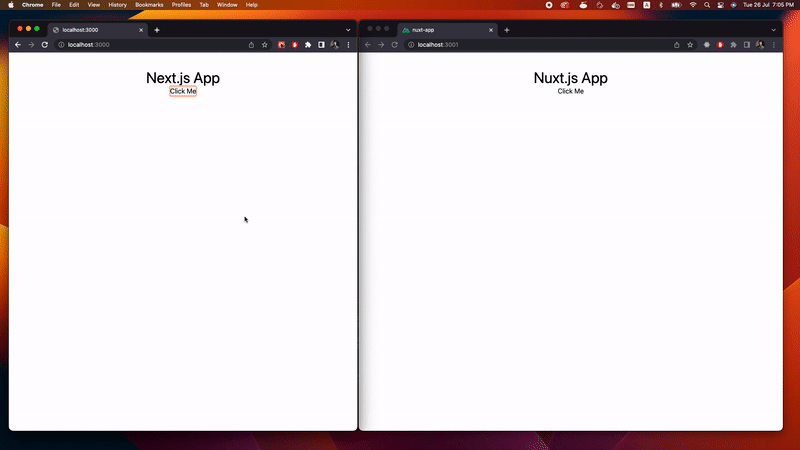

<div style="text-align: center"></div>

# Turborepo starter with React (Next.js), Vue (Nuxt.js), tailwindCSS, and TypeScript

This is a [Turborepo](https://turborepo.org/) starter with two different apps/frameworks using (`React/Next.js`, `Vue/Nuxt.js`) with TailwindCSS installed and a shared `ui` package for each framework.

**Want to know/understand everything about this monorepo?** [Read this artical](https://blog.munafio.com/building-a-monorepo-using-turborepo-with-react-js-and-vue-js-b6b25d7e41f7)

## What's inside?

This turborepo uses [npm](https://www.npmjs.com/) as a package manager. It includes the following packages/apps:

### Apps and Packages

- `apps`
  - `next-app`: a [Next.js](https://nextjs.org) app
  - `nuxt-app`: a [Nuxt.js](https://nuxtjs.org) app
- `packages`
  - `react-ui`: a stub React component library shared across all React applications.
  - `vue-ui`: a stub Vue component library shared across all Vue applications.
  - `eslint-config-custom`: `eslint` configurations (includes `eslint-config-next` and `eslint-config-prettier`)
  - `tsconfig`: `tsconfig.json`s used throughout the monorepo

Each package/app is 100% [TypeScript](https://www.typescriptlang.org/).

<div style="text-align: center">

</div>

### Utilities

This turborepo has some additional tools already setup for you:

- [TypeScript](https://www.typescriptlang.org/) for static type checking
- [TailwindCSS](https://www.tailwindcss.com/) a utility-first CSS framework.
- [ESLint](https://eslint.org/) for code linting.
- [Prettier](https://prettier.io) for code formatting.
- [Husky](https://www.npmjs.com/package/husky) Modern native Git hooks made easy.

## Getting Started

First clone the repo, then install the dependencies

```
npm install
```

after that, start the development server (apps running in parallel)

```
npm run dev
```

That's it, enjoy!

## Author

- [Munaf A. Mahdi](https://twitter.com/munafiofficial)
